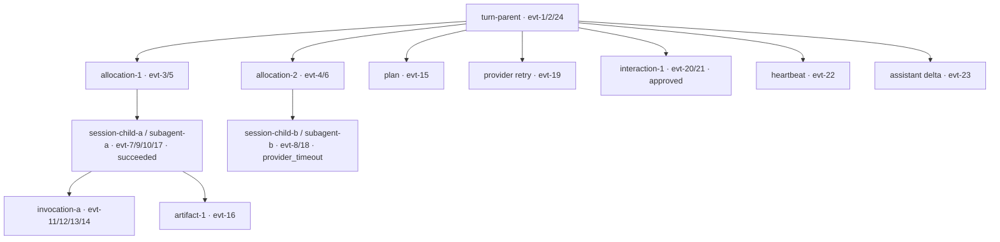

# Canonical Event Contract v1

本合同冻结 E-00/E-00a 的事件边界。`schemas/events/event-catalog-v1.json` 是机器可读目录，`schemas/events/event-envelope-v1.schema.json` 是 envelope 校验入口。

## 事件字段

| 字段 | 必需性 | 用途 | 用户面规则 |
|---|---|---|---|
| `protocol_version` | 必需 | envelope 版本，当前为 `1.0` | 原样透传 |
| `type` | 必需 | canonical 事件名称 | 不改名；历史回放适配器之外不使用 alias |
| `request_id` | 必需，可为 null | 请求关联和幂等 | 不作为事件排序依据 |
| `sequence` | 必需 | Gateway 生产端的单调序号 | relay 不重造、不按连接重排 |
| `occurred_at` | 必需 | producer 产生时间 | 用于诊断，展示排序以 lineage/sequence 为准 |
| `end` | 必需 | 是否为当前请求响应的流终止帧 | 进程级查询的 `end` 不绑定 session；会话执行终态绑定 session/run/turn |
| `tenant_id` / `user_id` | 条件必需 | 租户和用户亲和 | 控制面按权限下发 |
| `session_id` / `run_id` / `turn_id` | 过程事件必需 | 会话、运行、turn 身份 | 不允许从文本推断 |
| `event_id` | 过程事件及携带 session 的事件必需 | 事件去重和审计 | 客户端按此幂等 |
| `parent_item_id` / `interaction_id` / `artifact_id` | 条件必需 | 工具、交互、产物关联 | 未授权时保留引用，不泄露内容 |
| `metadata` | 可选 | 受控诊断元数据 | 不放 secret、prompt 或 transcript |
| `payload` | 必需 | 事件业务字段 | 按事件目录字段限制、长度限制和脱敏规则处理 |

## Baseline 36 逐项映射

| 事件 | 类别 | surface | producer | terminal |
|---|---|---|---|---|
| `request.accepted` | control | control | Harness Gateway | no |
| `protocol.negotiated` | control | control | Harness Gateway | no |
| `health.status` | control | control | Harness Gateway | no |
| `metrics.snapshot` | diagnostic | ops | Harness Gateway | no |
| `capabilities.report` | control | control | Harness Gateway | no |
| `session.opened` | session | control | Harness Gateway | no |
| `session.closed` | session | control | Harness Gateway | no |
| `session.draining` | session | control | Harness Gateway | no |
| `session.lease.updated` | lease | control | Harness Gateway | no |
| `session.lease.revoked` | lease | control | Harness Gateway | no |
| `session.lease.replaced` | lease | control | Harness Gateway | no |
| `session.lease.takeover` | lease | control | Harness Gateway | no |
| `turn.queued` | turn | user | Harness Gateway | no |
| `turn.started` | turn | user | HermesHostAdapter | no |
| `turn.completed` | turn | user | HermesHostAdapter | yes |
| `turn.failed` | turn | user | HermesHostAdapter | yes |
| `turn.cancelled` | turn | user | HermesHostAdapter | yes |
| `turn.controlled` | control | user | Harness Gateway | no |
| `assistant.delta` | assistant | user | HermesHostAdapter | no |
| `plan.updated` | plan | user | HermesHostAdapter | no |
| `tool.started` | tool | user | HermesHostAdapter | no |
| `tool.progress` | tool | user | HermesHostAdapter | no |
| `tool.completed` | tool | user | HermesHostAdapter | no |
| `subagent.started` | subagent | user | HermesHostAdapter | no |
| `subagent.completed` | subagent | user | HermesHostAdapter | no |
| `delegation.requested` | delegation | user | HostDelegationBroker | no |
| `artifact.created` | artifact | user | Harness projection | no |
| `clarification.requested` | interaction | user | InteractionController | no |
| `clarification.resolved` | interaction | user | InteractionController | no |
| `approval.requested` | interaction | user | InteractionController | no |
| `approval.resolved` | interaction | user | InteractionController | no |
| `warning` | diagnostic | user | Harness Gateway | no |
| `heartbeat` | liveness | user | Harness Gateway | no |
| `error` | error | user | Harness Gateway | no |
| `end` | control | control | Harness Gateway | yes |
| `shutdown.completed` | control | control | Harness Gateway | yes |

## Process extensions 逐项映射

过程扩展与 baseline 共用同一个 canonical namespace；来源行号由
[`hermes-event-inventory.json`](../evidence/hermes-event-inventory.json) 机器校验。

| 事件 | source/status | source path | 默认 surface | 默认权限 |
|---|---|---|---|---|
| `subagent.start` | hermes_native / source_confirmed | `vendor/hermes/tools/delegate_tool_progress.py:122-127,343-347` | user | session_participant |
| `subagent.complete` | hermes_native / source_confirmed | `vendor/hermes/tools/delegate_tool_child_run.py:705-715,875-907` | user | session_participant |
| `subagent.text` | hermes_native / source_confirmed | `vendor/hermes/tools/delegate_tool_child_run.py:658-662` | user | session_participant |
| `subagent.thinking` | hermes_native / source_confirmed | `vendor/hermes/tools/delegate_tool_progress.py:365-368` | restricted | explicit_reasoning_capability |
| `subagent_progress` | hermes_native_legacy_relay / source_confirmed | `vendor/hermes/tools/delegate_tool_progress.py:110-117,370-378` | user | session_participant |
| `delegation.resolved` | host_derived / host_derived_required | `src/networkclaw_harness/runtime/delegation.py:100-111,135-144,171-186` | user | session_participant |
| `tool.generating` | hermes_native_callback / source_confirmed_callback | `vendor/hermes/agent/stream_delivery.py:336-338` | user | session_participant |
| `reasoning.delta` | hermes_native_callback / source_confirmed_callback | `vendor/hermes/agent/stream_delivery.py:318-334` | restricted | explicit_reasoning_capability |
| `context.started` | harness_projection / source_confirmed | `src/networkclaw_harness/projection/events.py:293-299` | user | session_participant |
| `context.continued` | harness_projection / source_confirmed | `src/networkclaw_harness/projection/events.py:293-299` | user | session_participant |
| `provider.attempt` | harness_projection / source_confirmed | `src/networkclaw_harness/projection/events.py:303-306` | diagnostic | operator |
| `provider.retry` | harness_projection / source_confirmed | `src/networkclaw_harness/projection/events.py:303-306` | user | session_participant |
| `usage.updated` | host_derived / host_derived_required | `vendor/hermes/hermes_state_usage.py:17-21,277-303` | restricted | billing_or_operator |
| `checkpoint.updated` | harness_projection / source_confirmed | `src/networkclaw_harness/projection/events.py:300-302` | diagnostic | operator |
| `moa.reference` | hermes_native / source_confirmed | `vendor/hermes/agent/moa_loop.py:930-933,1224-1230,1347-1349` | diagnostic | operator |
| `moa.progress` | hermes_native / source_confirmed | `vendor/hermes/agent/moa_loop.py:1195-1197,1349` | diagnostic | operator |
| `moa.phase` | hermes_native / source_confirmed | `vendor/hermes/agent/moa_loop.py:1231-1235,1350` | diagnostic | operator |
| `moa.aggregating` | hermes_native / source_confirmed | `vendor/hermes/agent/moa_loop.py:1233-1235,1351` | diagnostic | operator |
| `grace.summary` | harness_projection / source_confirmed | `src/networkclaw_harness/projection/events.py:307-309` | user | session_participant |
| `finalizer.fallback` | harness_projection / source_confirmed | `src/networkclaw_harness/projection/events.py:310-312` | user | session_participant |

## 权限、脱敏和降级

| 事件/字段 | 默认 surface | 默认权限 | 脱敏与降级 |
|---|---|---|---|
| `turn.*`, `assistant.delta`, `plan.updated` | user | session participant | 文本长度受限；不得携带内部 prompt |
| `delegation.*`, `subagent.*` | user | session participant | 保留 `allocation_id`、parent/child lineage；`preview` 限长 |
| `tool.generating`, `tool.started`, `tool.progress`, `tool.completed` | user | session participant | 参数和结果只传 bounded summary；原始凭证和完整输出不传 |
| `artifact.created` | user | session participant | 只传 artifact reference、大小、媒体类型和 hash；内容走授权下载 |
| `approval.*`, `clarification.*` | user/control | session participant or controller | `interaction_id` 必须稳定；答案按权限回显 |
| `heartbeat`, `warning`, `error` | user/ops | session participant or operator | 限频；错误只传分类 reason code 和 bounded summary |
| `context.*`, `checkpoint.updated` | user/diagnostic | session participant or operator | 传状态、版本和引用，不传 transcript 快照 |
| `grace.summary`, `finalizer.fallback` | user | session participant | 保留受限终态摘要和 reason code；不得覆盖已锁存的更早终态 |
| `provider.attempt`, `provider.retry`, `moa.*` | diagnostic | operator by default | 可向用户降级为“正在重试/聚合”；不传内部路由凭证 |
| `usage.updated` | restricted | billing/operator | token/cost 摘要；不传 prompt、credential 或原始 reasoning |
| `reasoning.delta` | restricted | explicit capability only | 默认关闭；未授权时仅发送结构化摘要或 `warning` |

## 序号、Cursor 和 Replay

- 排序域是 `(session_id, run_id, execution_epoch)`，过程事件还携带 `turn_id`；不同 child stream 的 sequence 不能用于比较全局先后，必须通过 parent/child lineage 关联。
- Host 当前按请求响应从 1 递增 sequence。进入 canonical turn 流时必须使用独立 run，或者由权威 producer 保证同一 run 内持续递增；relay 不得自行补号。session 级控制请求的序号不得混入 turn replay 域。
- cursor 表示当前域中最后已确认的 upstream sequence，replay 返回严格大于 cursor 的原始事件。客户端只能在连续事件已处理后推进 cursor，不能因先收到较大的 sequence 而跳过缺口。
- 重放不得再执行 `user.input`、工具或 delegation；重复 event_id 且事实完全相同是幂等，同 ID 或同 sequence 携带不同事实必须显式报错。
- retention 超出、epoch 过期、背压中断和跨节点日志不可用必须返回可观测失败；通过授权 session resume/快照重新建立状态，不把空 replay 当成完整历史。当前 chatrtmgr ledger 是本地有界内存，未证明跨节点 durable replay。

## 目录状态和 Projection Gap

36 项 baseline 是 Host Protocol 名称，20 项 extension 是已确认来源的过程契约。`source-confirmed` 表示源码生产点存在，`host-derived` 表示需由 adapter 从 callback/状态构造字段；两者都不等于真实端到端已通过。v1 没有实验性事件；将来实验事件须显式登记状态和 capability，不能混入冻结集合。

| 差异 | 原始来源 | 契约处理 | 验证边界 |
|---|---|---|---|
| 名称损失 | Hermes `subagent.start/complete/text` 曾被折叠为 `subagent.started/completed` | 9 个 Hermes 原生扩展名称原样保留；baseline 旧名称仍登记用于历史读取，禁止实时 alias | E-02/E-07 核验 producer 和清理路径 |
| 缺少过程事实 | tool generating/progress、delegation resolution、interaction、plan、artifact | 保留 allocation/invocation/interaction/artifact 标识，缺 callback 时留下 warning/reason code | E-02 生产，E-06 组合验收 |
| 有意非用户面 | session/lease/protocol/health、checkpoint、provider attempt、MoA | control/diagnostic 订阅消费或受控 unknown bucket；不改为 assistant 文本 | E-03/E-04 权限与消费者验收 |
| 权限降级 | reasoning、subagent thinking、usage、工具和产物内容 | 按下表/来源 inventory 限权；bounded summary 或 warning 必须有原因 | 原始思维链永不进入普通用户流 |
| 身份和重放不足 | request sequence 与 session/run cursor 的范围差异 | 按上述排序域处理，不宣称 session 全局连续序号或跨节点重放已完成 | E-06 需提供真实 ledger 证据 |

每个扩展事件的权限、最小字段和 lineage 以 inventory 对应行登记，脱敏/降级规则按事件族继承权限表。`subagent.thinking` 必须采用 restricted 规则，不能继承普通 `subagent.*` 权限。

## Fixture 过程树

下面的节点只使用 fixture 中的 ID 和事实。每个节点标注原始 event_id，双 child 在主任务终态前各自完成；图中的关系不依赖 assistant 文本，也不表示两个 child 的时钟可直接比较。

乱序输入先按稳定 allocation/subagent/invocation/interaction/artifact ID 建立索引，再按 lineage 挂载，显示次序使用各流的 sequence。重复事件按 event_id 去重；终态后的事实保留为审计输入。此处是 E-00a 的设计 fixture；浏览器渲染与真实生产链路分别由 E-04/E-06 验收。

## 兼容和终态

- baseline 目录固定 36 个事件；过程扩展与 baseline 共享 `networkclaw.events.v1` 命名空间。
- 未知事件保留并可观测；未知命令 fail-closed。canonical transport 不使用事件名 alias。
- `sequence` 由 Gateway producer 产生；relay、lobby 和 web2 只能验证、转发和建立 cursor。
- 每个执行域的第一个 turn terminal 锁存终态；后续帧只能进入 stale audit。`end`/`shutdown.completed` 终止对应请求响应，不能把查询或控制请求的结束当成 turn 成功。`finalizer.fallback` 仅在 payload 状态为终态且 `end=true` 时锁存；同名非终态状态仍是过程事实。
- 展示摘要可以合并、折叠或限频，但不能替代事实事件。丢弃必须有权限、采样或背压原因。
- Hermes 的 `pet.*`、`voice.*`、`display.*`、`window.*`、`notification.show` 和 raw reasoning 不属于 NetworkClaw 会话协议。

## E-07 实时生产边界

- `execution_path=harness` 的实时链路唯一事实源是 `canonical_event` envelope：Harness Gateway → chatrtmgr → lobby → WebSocket → web2。
- Gateway gRPC relay 只接受 canonical event 和 `done`/`error` 传输控制帧；旧 `content`、`reasoning`、`tool_start`、`tool_end`、`run_state` 等 chunk 不得进入 Harness 实时生产链路。
- lobby 在收到 canonical envelope 时原样转发；落库摘要从校验后的 `assistant.delta`、`tool.*` 和受限 reasoning summary 读取，不从旧 chunk 反推事实。
- web2 实时投影只消费 canonical event；旧 chunk parser、`harness.Project` 和旧 oneof 仅允许历史消息读取、隔离回放或 legacy 对照测试使用。
- 旧事件名（例如 `subagent.started`/`subagent.completed`）不作为实时 alias；历史读取适配器可以读取旧名称，但不得写回 canonical ledger。

## E-00/E-00a 证据

- [event-catalog-v1.json](../../schemas/events/event-catalog-v1.json)
- [event-envelope-v1.schema.json](../../schemas/events/event-envelope-v1.schema.json)
- [hermes-event-inventory.json](../evidence/hermes-event-inventory.json)
- [process-tree-state-machine.json](process-tree-state-machine.json)
- [process-tree-fixture.json](../../tests/fixtures/events/process-tree-fixture.json)
